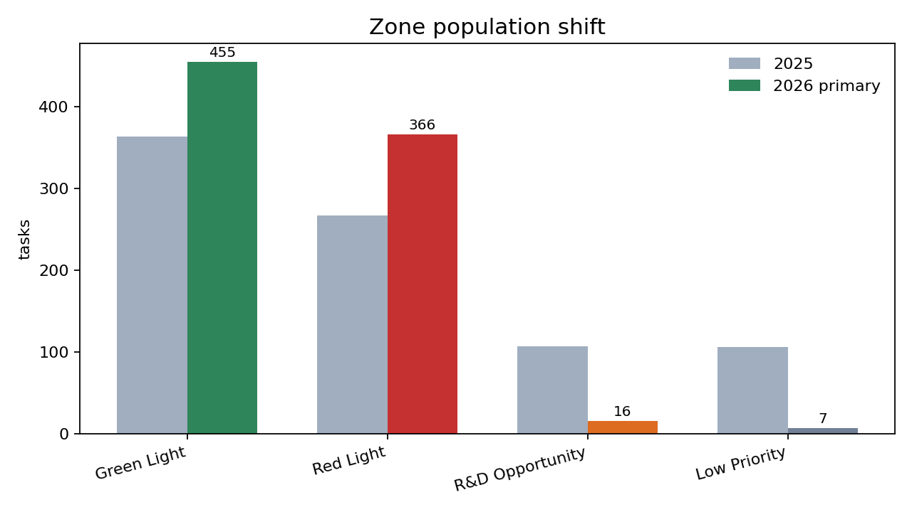
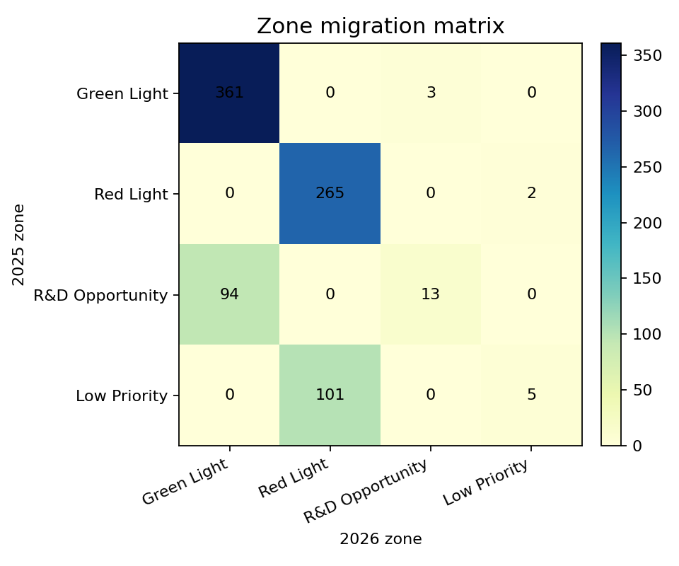
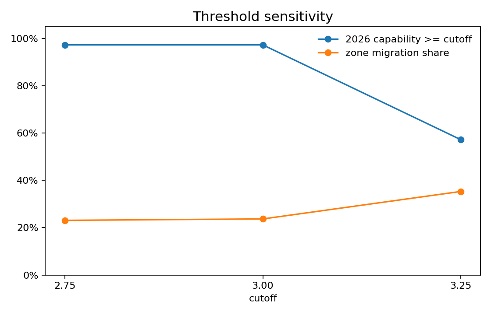
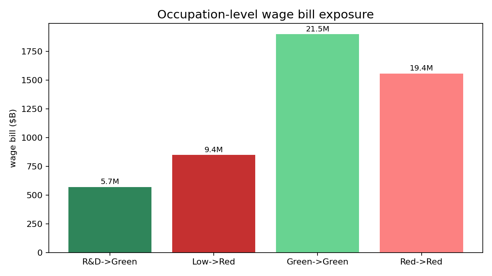
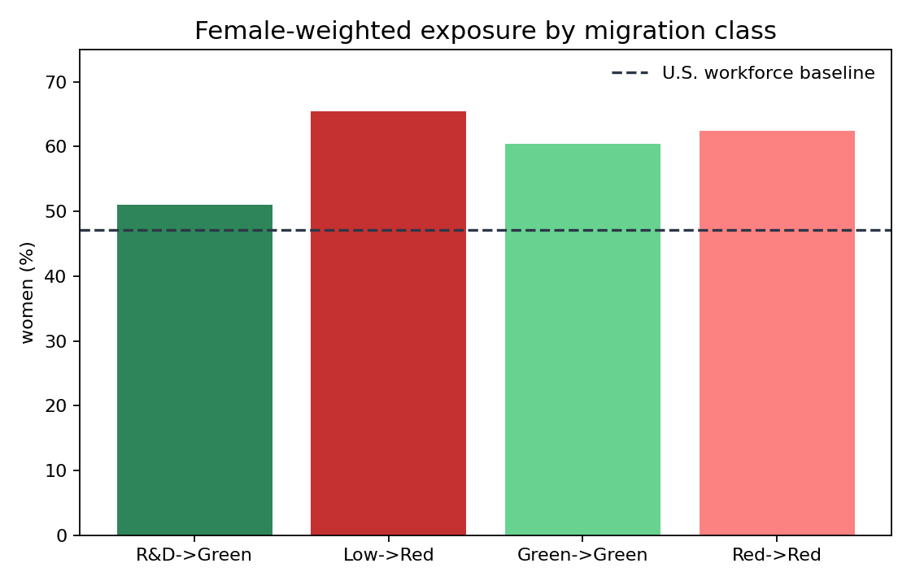
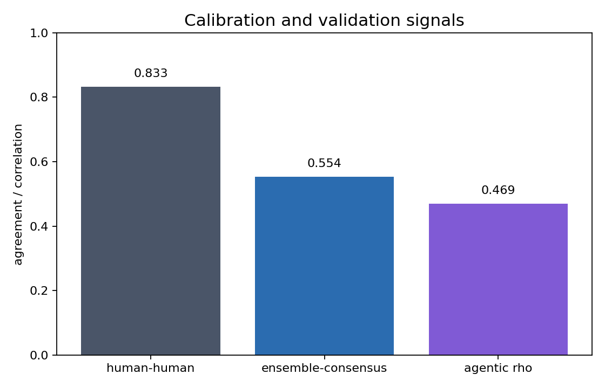

# Stanford's Job-by-Job AI Capability Map Got Rewritten in 11 Months

By Sam Meyer

In May 2025, Stanford's SALT Lab published WORKBank — a database of 844 occupational tasks across 104 U.S. occupations, scored on two axes: how much workers want AI to help with each task, and how capable AI agents are at doing it. The paper, by [@EchoShao8899](https://x.com/EchoShao8899), [@Diyi_Yang](https://x.com/Diyi_Yang), [@erikbryn](https://x.com/erikbryn) and colleagues, sorted every task into one of four zones:

- **Green Light** — workers want AI to help, AI is capable
- **Red Light** — AI is capable, workers do not want help
- **R&D Opportunity** — workers want help, AI is not capable yet
- **Low Priority** — neither

The paper's most-cited finding: **41% of YC startup task targeting** sat in the Red Light + Low Priority zones. Misalignment between AI productization and worker preferences.

The capability column was scored against the late-2024-to-mid-2025 frontier. The April 2026 frontier — Codex OAuth GPT-5.5 xhigh, Kimi K2.6, OpenAI GPT-5.5, Grok 4.20 — is a different beast. I held worker desire fixed at its 2025 value, rescored the capability axis with a three-model LLM-as-judge ensemble against rubric-anchored benchmark evidence, and looked at what migrated.

Here is what changed.

## The four-zone framework collapsed at the original cutoff

In 2025, 75% of tasks scored at or above the 3.0 capability threshold. In April 2026, **97.3%** do. R&D Opportunity dropped from 107 tasks to 16 (an 85% decline). Low Priority dropped from 106 to 7.

Two of four boxes essentially emptied out. Twenty-four percent of all 844 tasks (200, with a 95% bootstrap CI of [177, 225]) crossed a zone boundary.

The transition matrix is sharp:

Two flows do almost all the work:
- **R&D Opportunity → Green Light: 94 tasks.** Workers asked for AI help; capability has now arrived.
- **Low Priority → Red Light: 101 tasks.** Workers did not ask for AI help; capability arrived anyway.

Both cell counts are 2.6× higher than a permutation null that randomly reassigns 2026 capability deltas across tasks (p < 0.001 for each).

The reverse flows are tiny — 3 Green→R&D, 2 Red→Low, 5 Low→Low. Capability did not move down for already-Green or already-Red tasks. The story is one-directional.

## The "98%" headline is threshold-fragile

Here is the most important caveat in the whole study. The four-zone framework's threshold of 3.0 was calibrated to the 2025 capability distribution. Drift the capability axis upward by half a Likert-mean point (3.46 → 3.64), keep the threshold fixed, and most of the distribution lands above it. That is most of where the headline 97.3% comes from.

At cutoff 2.75: 75% → 97%. The 2025 distribution was already mostly above this lower bar.
At cutoff 3.0 (the published cutoff): 75% → 97%. The headline.
At cutoff 3.25: 59% → 57%. Smaller drift, but still substantial.

The above-threshold percentage holds up even when the cutoff shifts by a quarter-point — drift is real on the continuous distribution. The framework-collapse claim is the more fragile one: if you classify tasks by *rounded ensemble median*, the four-zone framework loses its R&D Opportunity and Low Priority quadrants only at cutoffs ≤ 3.0. At cutoff 3.25 (rounded medians), R&D Opportunity refills to 106 tasks and Low Priority to 255 — the framework survives.

In other words: capability has measurably moved, and the published 3.0 threshold no longer separates the four-zone classifier into populated quadrants. **The drift result is real; whether the framework "collapsed" depends on whether you preserve the original cutoff.**

The honest summary: capability moved enough that the original threshold no longer separates. That is itself a finding about the framework, not a finding about the workforce.

## Where the migration concentrates: occupations and dollars

Joining BLS occupation-level mean annual wage and employment to the migration table (full-occupation employment, treated as upper bound):

- **R&D → Green:** 48 occupations, 5.8M U.S. workers, ≈ $580B annual wage bill. Tasks workers asked for help with where capability has now arrived. Top examples: production planning, regulatory compliance maintenance, judicial law clerk file verification, sales presentation prep, clinical data flow tracking, logistics tracking.
- **Low → Red:** 52 occupations, 9.4M workers, ≈ $850B annual wage bill. Tasks workers did not ask for help with where capability arrived anyway. Top examples: ticket and document issuance, secretarial correspondence, network and LAN configuration, HR test scheduling, medical appointment booking.

Twelve of the top 20 most-exposed occupations by wage bill are clerical, administrative, or office-support roles. The remaining eight are technical or managerial: Computer & Information Systems Managers ($121B), Computer Systems Analysts ($56B), Personal Financial Advisors ($43B), Mechanical Engineers ($32B). The drift is not a low-wage story; the median exposed worker earns around $90,000.

## Demographic exposure: Low → Red is 65.5% female-weighted

Cross-walking BLS Current Population Survey 2024 occupation-level demographic shares to 50 of the 104 in-scope occupations (matched by occupation title — coverage caveat):

- The Low → Red bucket is **65.5% female-weighted**, against a 47.1% workforce baseline. Eighteen percentage points above baseline.
- The R&D → Green bucket is closer to baseline at 51.0% female.
- The two stable buckets sit between (62.4% Red→Red, 60.4% Green→Green).

Clerical, secretarial, and scheduling occupations remain disproportionately female. The migration class where capability arrived without asking — Low → Red — concentrates in those occupations. The migration class where workers asked for help and got it — R&D → Green — is closer to demographic baseline.

Two caveats stack on this finding. First, the demographic match rate is 50/104; an IPUMS USA ACS PUMS extract with explicit SOC codes is the publication-grade upgrade. Second, **capability is not deployment.** Frontier-model self-assessment of feasibility says nothing about which agents are actually deployed, against which jobs, in which firms, on which timeline. The 65.5% female stat is exposure to a feasibility threshold-crossing, not exposure to displacement.

## The YC misalignment claim flipped without changing

The upstream paper's most-cited derivative was that 41% of YC startup company-task mappings sat in Red + Low zones in 2025 — a misalignment claim. Recomputing with 2026 capability, on 841 of 2,076 published YC mapping rows that match by (task, occupation):

| zone | 2025 share | 2026 share |
|---|---:|---:|
| Green Light | 45.6% | 57.3% |
| Red Light | 29.4% | 40.7% |
| R&D Opportunity | 13.2% | 1.6% |
| Low Priority | 11.8% | 0.4% |

Misalignment share (Red + Low) is unchanged: **41.2% in 2025, 41.2% in 2026**. The headline number is preserved.

The composition flipped. In 2025 the 41% comprised both startups targeting unwanted-but-feasible work (Red Light, 29.4%) and startups targeting infeasible work (Low Priority, 11.8%). In 2026 it is essentially all Red Light (40.7%): capability has arrived into the entire Low Priority sub-bucket of YC targeting.

The implication: under 2025 capability, "41% in Red+Low" was a statement about a heterogeneous population — startups targeting both feasibility-blocked and demand-blocked tasks. Under 2026 capability, it is a homogeneous claim — startups are predominantly targeting feasible-but-low-desire tasks.

**Same denominator. Opposite meaning.** The Red + Low composite metric no longer distinguishes "misaligned" (workers don't want this and AI can't do it) from "feasible-but-undesired" (workers don't want this but AI can do it). Whether YC startup task targeting is misaligned now depends entirely on whether you weight worker preferences as the primary alignment criterion. The upstream paper's headline number survives. Its meaning does not.

## Calibration: why you should believe any of this

LLM-as-judge has a self-grading prior. The judges scoring tasks are the same model family the rubric explicitly names as the deployment target. Family caps in the rubric (physical / sustained interpersonal / safety-critical / novel research) mitigate the upper tail. The score-3-vs-4 boundary, where most drift sits, has no rubric-based external check. So I added two:

**Two-rater human calibration on a stratified 50-task sample.** Inter-human linear-weighted Cohen's κ = **0.834**, with 95% bootstrap CI [0.699, 0.937]. Ensemble vs the rounded sam+r2 consensus = **0.554**, CI [0.338, 0.734]. The lower CI bound overlaps the pre-registered 0.4 gate — the point estimate passes; the uncertainty is wide because n=50 with two raters is underpowered. Binary ≥3 agreement is 94% on calibration, 100% inter-human.

**Twenty-task agentic spot-check via Perplexity Comet.** Comet attempted each sampled task using web tools and synthetic data; I graded the captured response 1–3 (1=failed, 2=partial, 3=succeeded with usable artifact). Spearman ρ between predicted capability and realized agent grade = **0.469 (p = 0.0368)**. The cap=2 bucket averaged grade 2.2 (mostly partial — physical-tier tasks: SCADA monitoring, hardware tests, biofuels production); the cap=4 bucket averaged 3.0 and the cap=5 bucket averaged 2.8 (full success with usable artifacts). The preserved spot-check still supports the direction of the capability scores, with a moderate positive correlation after the rerun.

Limitations I am not hiding:
- Single-author calibration with one second human rater (n=2 humans).
- Rubric was iterated against the calibration set after the first version failed the κ gate; the calibration set is therefore not held-out for the production rubric. A fresh confirmatory n=30 sample is documented and not yet scored.
- Primary rerun replacement: Anthropic auth was unavailable, so the 2026-07-07 primary triple uses Codex OAuth GPT-5.5 xhigh in place of Opus. Grok 4.20 is sensitivity only.
- Kimi cited an empty benchmark anchor list on 72% of its calls — one of three judges is functionally unanchored on most tasks. The ensemble effectively has two anchored raters and one judge-from-priors.
- Demographic match rate is 50/104 occupations.
- Worker desire is held at 2025 by design. Worker preferences may have moved.
- The 97.3% above-threshold figure is dated 2026-07-07. Models released after this date will produce different numbers under the same protocol.

## What this does and does not say

This is a frontier-model self-assessment of task feasibility under fixed 2025 worker preferences, calibrated against two human raters with bootstrap confidence intervals overlapping the pre-registered gate at the lower bound. It is **not** a deployment claim. It is **not** a labor-impact estimate. It is **not** a re-audit of the upstream paper's worker-survey methodology.

What it is: evidence that the capability axis of WORKBank has moved enough between mid-2025 and mid-2026 that the published 3.0 threshold no longer separates the dataset into four populated quadrants. Most of the drift mass is concentrated in two flows — workers got the help they asked for in 94 tasks, and capability arrived without asking in 101 tasks — concentrated in clerical and administrative occupations totaling about $1.4T in U.S. annual wage bill across 15 million workers.

The original paper's 41% misalignment finding holds numerically in 2026. The composition flipped. That compositional shift is the single most informative summary of what changed.

## Repo, paper, dashboard

- **Repo + 12 analysis reports:** [github.com/swmeyer1979/workbank-drift-2026](https://github.com/swmeyer1979/workbank-drift-2026)
- **Interactive dashboard** (filter by occupation, zone, migration; Sankey, distribution charts, full task table): [workbank-drift-dashboard.vercel.app](https://workbank-drift-dashboard.vercel.app)
- **Paper draft (5K words):** [paper.md](https://github.com/swmeyer1979/workbank-drift-2026/blob/master/paper.md)
- **One-page findings:** [findings.md](https://github.com/swmeyer1979/workbank-drift-2026/blob/master/findings.md)
- **Methodology:** [METHODOLOGY.md](https://github.com/swmeyer1979/workbank-drift-2026/blob/master/METHODOLOGY.md)

Underlying WORKBank dataset is fetched at build time from the [SALT Lab Hugging Face repo](https://huggingface.co/datasets/SALT-NLP/WORKBank). Code and derivative tables are MIT-licensed; the upstream dataset has no declared license as of 2026-04-24 and is not redistributed here.

Cite Shao et al., 2025 — [arXiv:2506.06576](https://arxiv.org/abs/2506.06576) — alongside this drift study.
